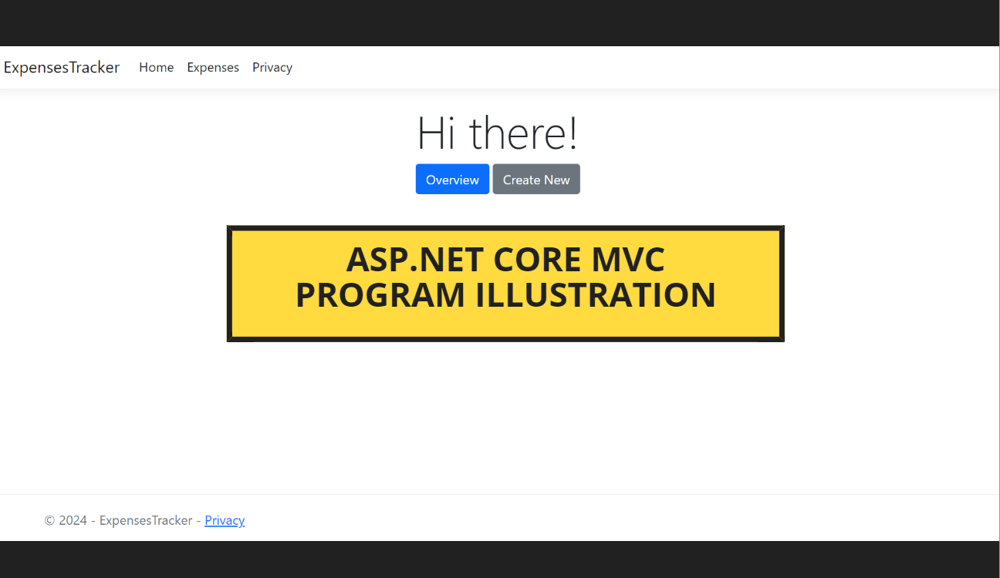

# ASP.NET Core MVC Application: Expenses Tracker

The **Expenses Tracker** is a streamlined **ASP.NET Core MVC application** designed to help users log and track their expenses. With each expense entry assigned a unique `ID`, users can efficiently organize and reference their spending. The application automatically calculates the `total amount spent`, providing a straightforward way to manage personal finances.

## Key Features
- **Log Expenses**: Enter descriptions and amounts for each expense.
- **View Expenses**: An overview of all expenses with their details
- **Unique ID Assignment**: Each entry is given a unique identifier for easy tracking.
- **Edit/Delete Expenses**: Use buttons to update or remove existing expenses by ID
- **Total Calculation**: Automatically calculates the total amount spent based on the logged expenses.

## Technologies Used
- **ASP.NET Core MVC**: Implements the Model-View-Controller design pattern.

## Concepts Learned
This project helped me deepen my understanding of the following **ASP.NET Core MVC** concepts:
- **MVC Architecture**: The separation of concerns through Models, Views, and Controllers.
- **Routing**: Defining URL patterns and routing them to the appropriate controllers and actions.
- **CRUD Operations**: Implementing Create, Read, Update, and Delete functionalities within the MVC structure.
- **Entity Framework with In-Memory Database**: Leveraging Entity Framework Core for data handling without using a physical database, great for development and testing.

## What's Next?
With a strong grasp of MVC and internal CRUD operations, I'm now moving towards:
- **Controller-Based APIs**: Implementing APIs using controllers to handle HTTP requests more efficiently.

## Dependencies
- **Microsoft.EntityFrameworkCore**: Provides the base framework for data access.
- **Microsoft.EntityFrameworkCore.InMemory**: For handling data in memory during development and testing.

## Program Illustration
### **Click on the thumbnail** below to watch an illustration of the program

